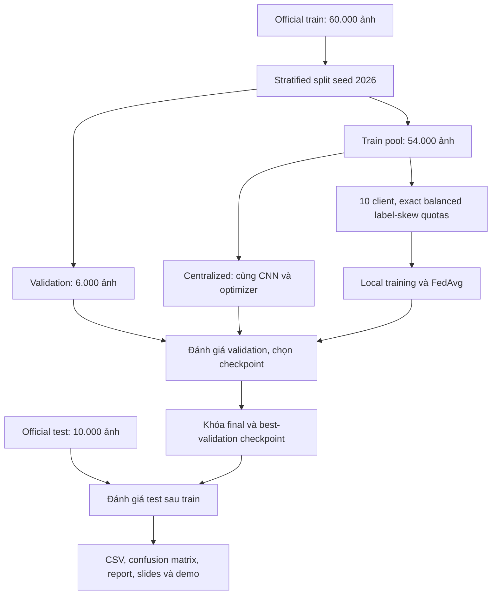
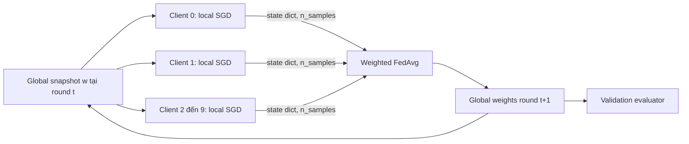

# Kiến trúc và hợp đồng dữ liệu

## Cách đọc một thí nghiệm

`main.py` đọc YAML qua `load_config`, sau đó gọi `run`. Trong `src/runner.py`, `run` giữ khóa ghi độc quyền; `_run` thực hiện các bước theo thứ tự:

1. Kiểm tra config/backend của run cũ, đặt seed, chuẩn bị dữ liệu và CNN.
2. Nếu chạy FL, gọi `prepare_partitions` để tạo/lưu train và local-validation partitions. Script `experiments/prepare_data.py` dùng cùng hàm này.
3. Khôi phục weights/history nếu resume; nếu chạy mới, đánh giá validation ở round 0.
4. Mỗi round: train → đánh giá global validation → ghi checkpoint/history/manifest.
5. Sau round cuối, gọi `evaluate_checkpoints` trong `evaluation/post_training.py`. Hàm này khóa checkpoint theo validation trước khi đánh giá test, lưu đường test và kết quả cuối.

Ba helper trong runner có nhiệm vụ riêng: `_build_manifest` ghi provenance; `_restore_history` đọc checkpoint hoàn tất gần nhất; `_history_row` đặt tên từng trường CSV. Không dùng danh sách giá trị theo vị trí để ghép vào tên cột.

## Các biến cần hiểu khi bảo vệ

| Biến | Ý nghĩa |
|---|---|
| `x`, `y` | Tensor ảnh và nhãn của official train; `train_idx` / `val_idx` chọn hai phần không trùng nhau |
| `clients` | Danh sách 10 mảng chỉ số train, mỗi client có 5.400 ảnh |
| `counts[client_id, class_id]` | Quota ảnh của một class tại một client |
| `global_state` | Bản sao trọng số global bất biến, mọi client cùng bắt đầu từ bản này |
| `sample_counts` / `n_samples` | Số ảnh riêng của client, dùng trọng số `n_k / sum(n_k)` trong FedAvg |
| `examples_seen` | Tổng lượt ảnh đã xử lý qua các local epochs, dùng để kiểm tra ngân sách |
| `optimizer_steps` | Số lần gọi `optimizer.step()`, có tính cả batch cuối chưa đủ 64 ảnh |
| `rows` | Validation history; đây là nguồn chọn best-validation checkpoint |

`train_local` lần lượt shuffle indices bằng seed của round/client/epoch, tính cross-entropy, backpropagate và cập nhật SGD. `centralized_epoch` gọi cùng vòng SGD trên toàn train pool. Trong FL, `client_update` nạp lại `global_state` trước mỗi client; `federated_round` thu các state độc lập và gọi `fedavg` một lần sau khi đủ 10 client.

`fedavg` chỉ cộng các tensor sau khi kiểm tra keys, shapes, dtypes và finite values. Thứ tự client, RNG streams, các phép toán trên tensor và key trong checkpoint được giữ nguyên khi tổ chức lại code.

## Dữ liệu và đánh giá



Validation và test không được truyền vào hàm gradient update. Download/chuẩn hóa test có thể diễn ra khi chuẩn bị dữ liệu, nhưng evaluator chỉ đánh giá test sau khi train đã hoàn tất và chọn checkpoint từ validation.

## Một round FedAvg



Server aggregation `fedavg(client_states, sample_counts)` chỉ nhận model tensors và số ảnh riêng. Vòng điều phối mô phỏng vẫn nằm cùng chương trình chuẩn bị dữ liệu và truyền tensor/index cho local trainers. Dự án không tạo cách ly bộ nhớ hay privacy guarantee.

## API chính

| Module | Hợp đồng |
|---|---|
| `data/dataset.py` | HTTPS + checksum, normalize, split index cố định và manifest |
| `data/partition.py` | Exact quota, indices không replacement, ma trận class counts, TV và hash |
| `data/loaders.py` | Minibatch từ tensor/index, shuffle bằng generator riêng, giữ batch cuối |
| `models/cnn.py` | Input N×1×28×28, output N×10 logits |
| `training/local_train.py` | Local SGD, trả n_samples, loss_sum, examples_seen, optimizer_steps |
| `federated/client.py` | Reload global snapshot trước mọi local update, trả clone state dict |
| `federated/fedavg.py` | Weighted mean n_k/N, kiểm tra keys/shapes/dtypes/finite tensors |
| `federated/server.py` | Full participation, không nối model client này sang client sau |
| `evaluation/metrics.py` | Inference-only, loss theo số mẫu, đủ 10 labels, zero_division=0 |
| `evaluation/post_training.py` | Test curves sau train, final/best-validation metrics, final-model local validation |
| `runner.py` | Config, initial hash, manifests, training/validation, atomic checkpoints và resume |

`n_samples` đếm ảnh riêng để tính trọng số FedAvg. `examples_seen` đếm cả ảnh được xử lý lặp qua local epochs để tính ngân sách. E3 vẫn có n_samples=5.400/client nhưng examples_seen=16.200/client/round.

## Resume và artifact

Checkpoint round là commit marker: ghi qua file tạm rồi atomic replace. History nằm trong checkpoint nên có thể khôi phục cả model và log nếu CSV chưa kịp ghi. Mọi random shuffle xác định từ seed/round/client/epoch; CNN không dropout, optimizer không momentum nên không có optimizer history cần mang qua round. Resume bắt đầu lại round đang dở từ round hoàn tất trước đó.

Mỗi run có exclusive writer lock. Config khác cùng output bị từ chối. `manifest.json` có commit và initial-state hash, `predictions.npz` có nhãn/predictions test, CSV có metric mỗi round/epoch. Full checkpoint archive giữ mọi round; demo bundle giữ 15 checkpoint cuối và 100 ảnh test minh họa với license nguồn.

Trong kết quả bàn giao, các tiến trình CPU chạy đồng thời và một vài run có khôi phục từ checkpoint. Vì vậy runtime là thời gian quan sát của các round hoàn tất, không phải benchmark tốc độ FL qua mạng hay phép so GPU/CPU.

## Kiểm tra khi sửa code

```bash
python -m ruff check .
python -m pytest -q
python experiments/audit.py
```

Tests kiểm tra split/partition, FedAvg, CNN, metrics, resume của centralized/FL E1/FL E3 và thứ tự training → validation → test. Test có điểm validation hòa và điểm test ưu tiên checkpoint khác để kiểm tra test không tham gia chọn model. Audit đối chiếu 15 run đã lưu, ngân sách, partition coverage và metrics tính lại từ predictions.
