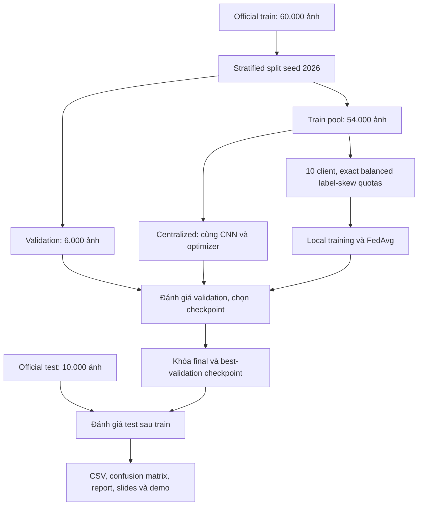
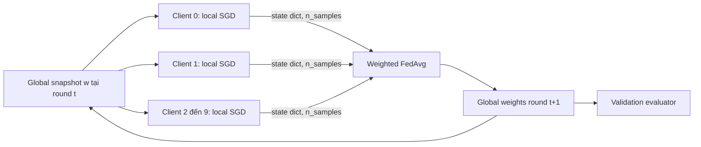

# Kiến trúc và hợp đồng dữ liệu

## Dữ liệu và đánh giá

Validation và test không được truyền vào hàm gradient update. Download/chuẩn hóa test có thể diễn ra khi chuẩn bị dữ liệu, nhưng evaluator chỉ đánh giá test sau khi train đã hoàn tất và chọn checkpoint từ validation.

## Một round FedAvg

Server aggregation `fedavg(client_states, sample_counts)` chỉ nhận model tensors và số ảnh riêng. Vòng điều phối mô phỏng vẫn nằm cùng chương trình chuẩn bị dữ liệu và truyền tensor/index cho local trainers. Dự án không tạo cách ly bộ nhớ hay privacy guarantee.

## API chính

| Module | Hợp đồng |
|---|---|
| `data/dataset.py` | HTTPS + checksum, normalize, split index cố định và manifest |
| `data/partition.py` | Exact quota, indices không replacement, ma trận class counts, TV và hash |
| `data/loaders.py` | Minibatch từ tensor/index, shuffle bằng generator riêng, giữ batch cuối |
| `models/cnn.py` | Input N×1×28×28, output N×10 logits |
| `training/local_train.py` | Local SGD, trả n_samples, loss_sum, examples_seen, optimizer_steps |
| `federated/client.py` | Reload global snapshot trước mọi local update, trả clone state dict |
| `federated/fedavg.py` | Weighted mean n_k/N, kiểm tra keys/shapes/dtypes/finite tensors |
| `federated/server.py` | Full participation, không nối model client này sang client sau |
| `evaluation/metrics.py` | Inference-only, loss theo số mẫu, đủ 10 labels, zero_division=0 |
| `runner.py` | Config, initial hash, manifests, per-round atomic checkpoints, resume, post-hoc test |

`n_samples` đếm ảnh riêng để tính trọng số FedAvg. `examples_seen` đếm cả ảnh được xử lý lặp qua local epochs để tính ngân sách. E3 vẫn có n_samples=5.400/client nhưng examples_seen=16.200/client/round.

## Resume và artifact

Checkpoint round là commit marker: ghi qua file tạm rồi atomic replace. History nằm trong checkpoint nên có thể khôi phục cả model và log nếu CSV chưa kịp ghi. Mọi random shuffle xác định từ seed/round/client/epoch; CNN không dropout, optimizer không momentum nên không có optimizer history cần mang qua round. Resume bắt đầu lại round đang dở từ round hoàn tất trước đó.

Mỗi run có exclusive writer lock. Config khác cùng output bị từ chối. `manifest.json` có commit và initial-state hash, `predictions.npz` có nhãn/predictions test, CSV có metric mỗi round/epoch. Full checkpoint archive giữ mọi round; demo bundle giữ 15 checkpoint cuối và 100 ảnh test minh họa với license nguồn.

Trong kết quả bàn giao, các tiến trình CPU chạy đồng thời và một vài run có khôi phục từ checkpoint. Vì vậy runtime là thời gian quan sát của các round hoàn tất, không phải benchmark tốc độ FL qua mạng hay phép so GPU/CPU.
