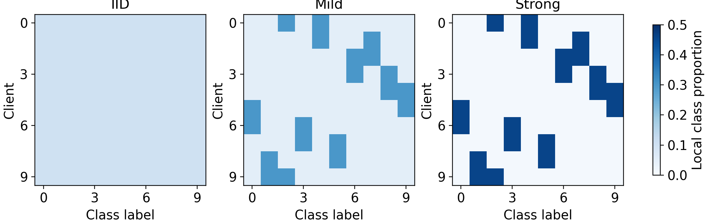
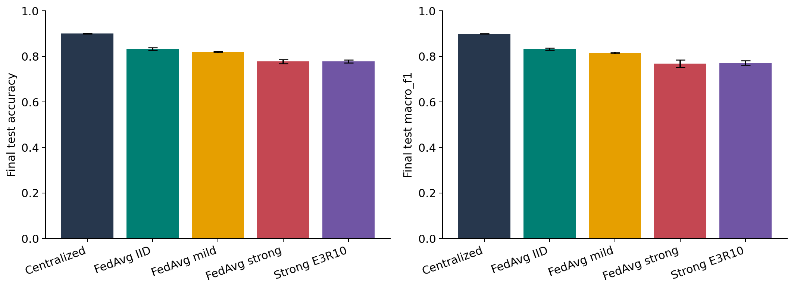
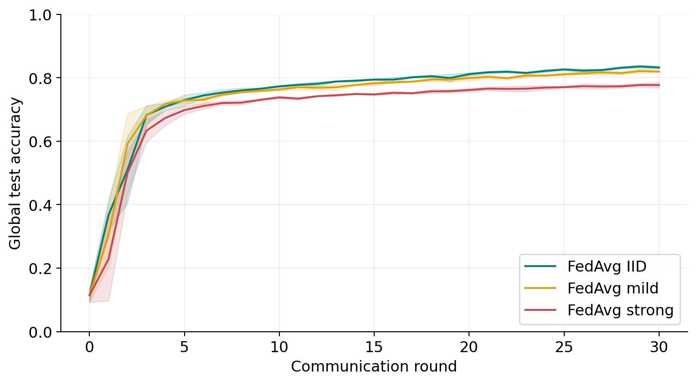
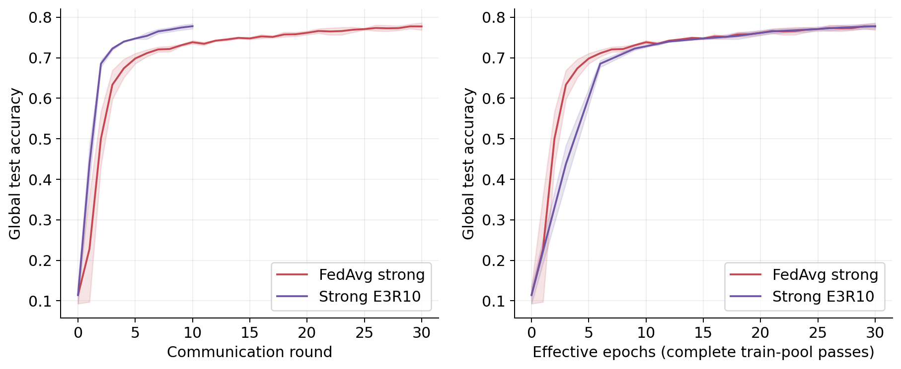
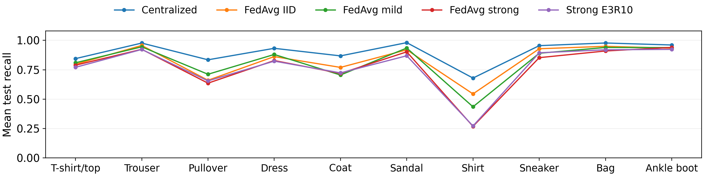
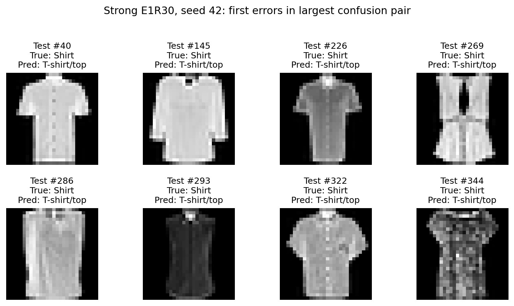

# Abstract

This project investigates how client label distributions affect federated image classification. A small convolutional neural network and a manually implemented FedAvg algorithm are evaluated on Fashion-MNIST with ten simulated clients. An exact quota design produces IID, mild and strong label skew while keeping client sample counts and global class totals fixed. Five configurations are evaluated over three seeds, with 1,620,000 training-image exposures per run. Final test accuracy is 90.13% for centralized training, 83.25% for IID FedAvg, 81.93% for mild skew and 77.73% for strong skew. Under strong skew, three local epochs and ten rounds achieve 77.77% accuracy, close to one local epoch and thirty rounds at the same exposure budget. Error analysis identifies Shirt as the weakest class and examines traceable Shirt-to-T-shirt/top mistakes. Saved predictions, split indices and experiment manifests support an independent integrity audit. The findings demonstrate sensitivity to label skew within this controlled setting, while the local-epoch comparison suggests a potential aggregation trade-off. Conclusions remain limited to one dataset, one CNN, full participation and three seeds. The simulation supplies no formal privacy guarantee.

Keywords: federated learning; image classification; non-IID data; FedAvg; Fashion-MNIST.

# I. Introduction and Research Question

## 1. Problem statement

Images collected by different organizations can have very different label distributions. A clothing retailer specializing in footwear, for example, may hold few examples of shirts. Centralized training would combine these images into one dataset. Federated learning instead trains a shared classifier through local model updates, while each client retains its training examples [1]. The resulting optimization problem depends on what each client observes between aggregation steps.

This project studies **label skew**: clients have equal sample counts but different proportions of the ten Fashion-MNIST classes. Equal quantities make distribution differences easier to interpret. A centralized CNN provides a reference, and FedAvg provides the main method. All clients participate in every round in a single-machine simulation.

## 2. Research questions and contributions

**RQ1:** How does FedAvg with IID client data compare with centralized training under the same image-exposure budget? **RQ2:** How do mild and strong label skew change final accuracy, macro-F1 and learning curves? **RQ3:** Under strong skew, can three local epochs and fewer aggregation rounds retain performance at fixed training exposure?

The project delivers a transparent PyTorch implementation, an exact partition design, fifteen recorded runs and an offline inference demo. Its contribution is a controlled comparison and traceable error analysis. It does not introduce a new optimization algorithm. The experiments support conclusions within this dataset, CNN and participation protocol.

<!-- page -->
# II. Related Work

## 1. Federated averaging

McMahan et al. [1] introduced federated averaging, in which clients train local copies of a common model and the server combines their updated parameters according to sample counts. Their experiments establish model averaging as a practical approach to decentralized learning. Our implementation follows this central mechanism. It uses ten simulated clients and full participation so that the effect of label distributions can be examined without varying client sampling.

An important distinction is that one local epoch contains many minibatch updates. Averaging the resulting parameter vectors does not reproduce SGD on globally shuffled minibatches. Consequently, even the IID setting may differ from centralized learning. We investigate that difference empirically rather than assuming that IID FedAvg must match its centralized reference.

## 2. Statistical heterogeneity

Hsu, Qi and Brown [3] study the effects of non-identical distributions in federated visual classification. Their work motivates treating heterogeneity as a controlled experimental variable rather than a binary property. Here, an explicit quota matrix provides three known severity levels while retaining equal numbers of images per client and equal global class totals.

FedProx [4] adds a proximal term to local objectives to address heterogeneity. SCAFFOLD [5] uses control variates to correct client drift. These approaches show why divergence between local optimization trajectories matters and suggest useful future comparisons. Neither method is implemented or evaluated in this project. We use FedAvg as the only federated optimizer so that the experiment remains focused on the data distribution.

## 3. Dataset and privacy context

Xiao, Rasul and Vollgraf [2] provide Fashion-MNIST, a ten-class benchmark with small grayscale images. It makes repeated controlled experiments feasible while retaining visually overlapping categories. Clothing categories such as Shirt and T-shirt/top also support meaningful qualitative error analysis.

Zhu, Liu and Han [6] demonstrate that shared gradients can reveal training information under particular conditions. Our server aggregation API receives model tensors and sample counts, but this design alone supplies no formal privacy guarantee. We do not test attacks or implement differential privacy or secure aggregation. The simulation concerns collaborative optimization and classification quality.

## 4. Position of this study

Unlike a study that changes model size or dataset together with heterogeneity, this comparison fixes the CNN, normalization, optimizer and training pool. The quota design is a project-specific experimental construction. It is not presented as the original partitioning method of any cited paper. Three seeds measure preliminary run-to-run variation, and conclusions remain descriptive.

<!-- page -->
# III. Dataset and Data Preparation

## 1. Dataset identity and version

Fashion-MNIST [2] contains 60,000 official training images and 10,000 official test images. Each image has one grayscale channel, resolution 28 x 28 and one of ten labels. We use the original 2017 Fashion-MNIST IDX distribution, identified by the four official gzip filenames and their MD5 checksums. There is no invented semantic release number. The authoritative dataset and license are available at https://github.com/zalandoresearch/fashion-mnist.

| Label | Class | Label | Class |
|---|---|---|---|
| 0 | T-shirt/top | 5 | Sandal |
| 1 | Trouser | 6 | Shirt |
| 2 | Pullover | 7 | Sneaker |
| 3 | Dress | 8 | Bag |
| 4 | Coat | 9 | Ankle boot |

Table 1. The ten official label meanings, preserved throughout the pipeline.

## 2. Split and preprocessing

A fixed stratified split with seed 2026 reserves 600 images per class for validation. The remaining 5,400 per class form the training pool. Thus training, validation and test contain 54,000, 6,000 and 10,000 images, respectively. The official test split remains independent and contains 1,000 examples of each class. Persisted indices use the order of the original official files.

Images become float tensors with shape N x 1 x 28 x 28 and normalization **(uint8 / 255 - 0.5) / 0.5**. The resulting range is [-1, 1]. There is no resizing, augmentation or fitted normalization statistic. The same transform applies to centralized and federated learning. No validation or test image enters a training minibatch.

## 3. Reproducing the processed data

`experiments/prepare_data.py` downloads the official files over HTTPS, verifies their official MD5 checksums, reproduces the split and saves all client partitions without training. `DATA.md` documents the dataset version, URLs, checksums, commands, label mapping and licensing. Processed tensors are deterministic transformations of official images, not a separately curated dataset.

The processed data are reproducible from the official download and committed split/partition indices. The release contains an additional downloadable, checksum-verified demo subset of 100 official test images with their original indices. Dataset caches are excluded from Git. Appendix B records the exact commands and artifact locations.

<!-- page -->
# IV. Controlled Client Partitioning

## 1. Balanced cyclic label skew

For each run seed, a deterministic random permutation pi specifies the ten classes. Client k has two dominant labels: pi[k] and pi[(k+1) mod 10]. Each label is dominant at exactly two clients. The prescribed class proportion is:

**p(k,c) = (1 - lambda)/10 + (lambda/2) I[c is dominant at client k].**

The indicator is one for either dominant class and zero otherwise. Lambda controls the mixture of globally uniform data and concentrated client data. This construction keeps the global class prior uniform, which avoids conflating local heterogeneity with a changed overall training distribution.

| Setting | Lambda | Dominant class | Other class | Images/client | TV |
|---|---:|---:|---:|---:|---:|
| IID | 0.0 | 540 | 540 | 5,400 | 0.00 |
| Mild | 0.5 | 1,620 | 270 | 5,400 | 0.40 |
| Strong | 0.9 | 2,484 | 54 | 5,400 | 0.72 |

Table 2. Exact training quotas; each client has two dominant and eight other classes.



## 2. Integrity and interpretation

For every setting, each matrix row and column sums to 5,400. Within a class, shuffled indices are allocated once without replacement. The union of all client sets equals the training pool, and no pair of client sets overlaps. The same class permutation is used across severities within a run seed. Between seeds, both class pairings and allocated image identities vary.

Total variation from the uniform class distribution is **TV = 0.5 sum(c) |p(k,c) - 0.1| = 0.8 lambda**. The severity values therefore have a quantitative interpretation. Strong clients retain all ten classes: 92% of their images belong to two dominant labels, and the remaining 8% cover the other labels. This study investigates synthetic label skew. It does not model differing camera domains, label corruption or unequal quantities.

<!-- page -->
# V. Methods

## 1. Centralized baseline and shared CNN

The baseline trains one CNN on minibatches shuffled from the complete 54,000-image training pool. It receives the same preprocessing, architecture, initialization seed, loss, learning rate and thirty complete passes as the federated runs. Its role is to quantify the effect of replacing global minibatch mixing with local training and aggregation. It is a reference under this protocol, not a universal performance bound.

| Layer | Configuration | Output shape | Parameters |
|---|---|---|---:|
| Input | Grayscale image | 1 x 28 x 28 | 0 |
| Conv1 + ReLU | 1 to 16, 3 x 3, padding 1 | 16 x 28 x 28 | 160 |
| MaxPool | 2 x 2, stride 2 | 16 x 14 x 14 | 0 |
| Conv2 + ReLU | 16 to 32, 3 x 3, padding 1 | 32 x 14 x 14 | 4,640 |
| MaxPool | 2 x 2, stride 2 | 32 x 7 x 7 | 0 |
| Flatten | 32 x 7 x 7 | 1,568 | 0 |
| Linear + ReLU | 1,568 to 64 | 64 | 100,416 |
| Linear | 64 to 10 | 10 logits | 650 |
| Total | SmallCNN | 10 logits | 105,866 |

Table 3. Architecture and parameter count, including biases.

Convolutions learn local spatial features, ReLU introduces nonlinearity and pooling reduces feature-map resolution. The final layers combine learned features into ten classification scores. The model is trained from scratch. No pretrained weights, BatchNorm or dropout introduce extra state into aggregation.

## 2. Objective and optimizer

For logits z and correct label y, cross entropy is **L(z,y) = -z[y] + log(sum(c) exp(z[c]))**. PyTorch CrossEntropyLoss receives raw logits. A separate softmax is used only when displaying probabilities during inference. The predicted label is the index of the largest logit.

Both methods use SGD with learning rate 0.01, batch size 64, zero momentum and zero weight decay. The final partial minibatch is retained. Centralized and local training call the same minibatch implementation, reducing differences caused by separate code paths. Local optimizer state is restarted each round. With zero momentum, no optimizer history persists beyond the parameter updates.

## 3. Comparison strategy

We compare final global models, not an ensemble of local predictions. Shared initialization hashes are equal across all five configurations within each seed. This pairing reduces one source of variability, but data ordering and optimization trajectories still differ. Accuracy, macro metrics and cross entropy describe complementary aspects of classifier quality.

<!-- page -->
# V. Methods (continued)

## 4. Main method: FedAvg

Let D(k) contain n(k) local examples and let N be the sum of all n(k). The global empirical objective is **F(w) = sum(k) (n(k)/N) F(k,w)**, where F(k,w) averages cross entropy over D(k). At round t, the server broadcasts a snapshot w(t). Every client starts from that same snapshot and performs E local epochs. Its updated weights are w(k,t+1).

The server computes **w(t+1) = sum(k) (n(k)/N) w(k,t+1)** [1]. All ten clients have n(k)=5,400, so each receives weight 0.1. The code nevertheless uses general sample-count weighting and tests unequal counts with a known arithmetic answer. Aggregation averages every floating parameter tensor, including biases.

## 5. Round procedure

```
initialize the global SmallCNN with the run seed
for round t = 1, ..., R:
    snapshot = clone(global_model.state_dict())
    local_states = []
    for client k = 0, ..., 9:
        local_model.load_state_dict(snapshot)
        train local_model on D(k) for E epochs
        append cloned local state and n(k)
    global_state = weighted_average(local_states, sample_counts)
    load global_state and evaluate fixed validation data
    save the complete round checkpoint and history
```

Listing 1. FedAvg control flow; test evaluation occurs after training.

The snapshot and returned states are independent copies. Reusing mutable tensor references would corrupt the averaging operation. Training clients sequentially in a Python loop is computational scheduling only: each receives the same global starting point. It does not let client k+1 continue from the trained weights of client k.

## 6. State, evaluation and resume

`src/federated/server.py` coordinates clients, `client.py` resets local state, and `fedavg.py` performs aggregation. The aggregation function has no training-dataset argument. It checks compatible tensor keys, shapes, dtypes and finite values. The simulation process initially loads all data to construct subsets, so the API design should not be mistaken for physical isolation across ten machines.

Checkpoints save the global state, configuration and completed history. Data-order seeds are derived from the run seed, round, client and epoch. Resume restarts from the last completed round, discarding a partially completed round. A test compares resumed and uninterrupted final parameter hashes. The demo loads a trained global checkpoint and performs inference without training.

<!-- page -->
# VI. Experimental Setup

## 1. Three required setups

**Setup 1: baseline versus main method.** Compare centralized CNN with FedAvg IID. Both use the same 54,000 training images and thirty effective passes, but differ in how minibatches and model updates are coordinated. This setup answers RQ1.

**Setup 2: main research experiment.** Compare FedAvg IID, mild and strong label skew with E=1 and R=30. This changes the client distribution while holding model, optimizer, quantities, participation and budget fixed. It answers RQ2.

**Setup 3: ablation and seed robustness.** Compare strong E1R30 against strong E3R10. The two runs share exactly the same partition and initial state within a seed. E and R change together to keep the exposure budget fixed. Each of the five configurations runs with seeds 42, 43 and 44, yielding fifteen completed runs. This setup answers RQ3 and measures seed sensitivity.

| Configuration | Lambda | Local epochs E | Rounds / epochs | Exposures/run |
|---|---:|---:|---|---:|
| Centralized | - | - | 30 epochs | 1,620,000 |
| FedAvg IID | 0.0 | 1 | 30 rounds | 1,620,000 |
| FedAvg mild | 0.5 | 1 | 30 rounds | 1,620,000 |
| FedAvg strong | 0.9 | 1 | 30 rounds | 1,620,000 |
| Strong E3R10 | 0.9 | 3 | 10 rounds | 1,620,000 |

Table 4. Locked experiment matrix. Each row uses all three run seeds.

## 2. Fairness and budget accounting

Each run processes 54,000 x 30 = 1,620,000 training-image exposures. Across fifteen runs the total is 24,300,000. Retaining the final partial batch gives centralized 30 x ceil(54,000/64) = 25,320 optimizer steps. Federated settings use 30 x 10 x ceil(5,400/64) = 25,500 local optimizer steps. Thus image exposure is equal, while optimizer steps differ slightly.

Aggregation frequency and minibatch composition are intrinsic method differences. Equal image exposure does not imply equal optimization trajectories or runtime. The E3 comparison is a fixed-compute aggregation trade-off, not an isolated intervention on local epochs with all other variables unchanged.

## 3. Execution environment

The recorded versions are PyTorch 2.8.0, torchvision 0.23.0, NumPy 2.2.6 and scikit-learn 1.7.2. The reproduction instructions target Python 3.12.

Recorded runs use one CPU thread per process on macOS arm64. Some processes ran concurrently, so wall time includes resource contention. We make no hardware-speed or network-latency claim. The source training commit, library versions, initial-state hash, configuration and partition identity are retained in every manifest.

<!-- page -->
# VI. Experimental Setup (continued)

## 4. Evaluation metrics

For a confusion matrix C with true labels in rows and predictions in columns, **accuracy = sum(c) C(c,c) / N**. For class c, precision is TP(c)/(TP(c)+FP(c)) and recall is TP(c)/(TP(c)+FN(c)). F1(c) is their harmonic mean. Macro precision, recall and F1 average the corresponding class scores over all ten labels. Zero denominators produce zero scores.

Because official test support is 1,000 images per class, macro recall equals accuracy. Macro-F1 still differs because class precision and recall interact nonlinearly. Cross entropy averages the correct-label negative log probability over all test examples. Loss accumulation weights the partial final batch by its actual size.

## 5. Checkpoint and test protocol

The primary table evaluates the final checkpoint after the fixed budget. A secondary table evaluates the checkpoint with the highest validation accuracy, breaking ties at the earliest round or epoch. Test data are evaluated after training and after validation checkpoint selection. The recorded protocol states that test curves are descriptive and do not determine hyperparameters or checkpoint choice.

The report retains the originally recorded experimental outputs. Rechecking their metrics verifies internal consistency and data coverage. It does not independently establish every historical decision about when a researcher inspected results. No new hyperparameter selection was performed for this report.

## 6. Variability and convergence indicator

For three seeds, the reported standard deviation is the sample SD: **s = sqrt(sum(i) (x(i) - mean(x))^2 / (3 - 1))**. Accuracy is expressed in percent and accuracy differences in percentage points. Other metrics remain on their native scales. We also report individual seed values in Appendix B.

R@80 denotes the first post-initialization validation point starting a sequence of three consecutive recorded points with accuracy at least 80%. When no such sequence appears, the result is recorded as not reached. The indicator is descriptive, not a convergence proof. Three points represent different effective training exposure for E1 and E3, so comparisons must retain the epoch context.

## 7. Integrity and reproducibility checks

An independent audit recomputes accuracy and macro scores from the 10,000 saved test predictions per run. It also checks complete budgets, equal initial hashes within seeds, identical strong E1/E3 partitions, split coverage and consistency of final histories. The test suite checks weighted averaging, no aliasing, local snapshot resets, known-answer metrics, shape and parameter count, tiny-dataset learning and deterministic resume.

PyTorch reproducibility guidance [7] cautions that results may vary between platforms and releases. Seeds and saved artifacts support reproduction in the recorded environment. CPU, CUDA and MPS execution are supported options, but this report's official numbers were produced on CPU.

<!-- page -->
# VII. Results and Discussion

## 1. Final-budget comparison

| Setting | Accuracy (%) | Macro precision | Macro-F1 | Test CE |
|---|---|---|---|---|
| Centralized | 90.13 +/- 0.14 | 0.9013 +/- 0.0007 | 0.9004 +/- 0.0013 | 0.2756 +/- 0.0072 |
| FedAvg IID | 83.25 +/- 0.58 | 0.8357 +/- 0.0035 | 0.8317 +/- 0.0054 | 0.4588 +/- 0.0106 |
| FedAvg mild | 81.93 +/- 0.18 | 0.8169 +/- 0.0025 | 0.8154 +/- 0.0026 | 0.4875 +/- 0.0039 |
| FedAvg strong | 77.73 +/- 0.92 | 0.7690 +/- 0.0167 | 0.7685 +/- 0.0172 | 0.5839 +/- 0.0176 |
| Strong E3R10 | 77.77 +/- 0.60 | 0.7712 +/- 0.0084 | 0.7711 +/- 0.0099 | 0.5838 +/- 0.0196 |

Table 5. Official-test metrics, mean +/- sample SD across seeds 42, 43 and 44. Macro recall equals accuracy expressed on [0,1]. Full per-seed metrics are retained in CSV.



## 2. Baseline versus federated training: RQ1

Centralized accuracy is 90.13% compared with 83.25% for IID FedAvg, a gap of 6.88 percentage points. Macro-F1 is 0.9004 and 0.8317, respectively. Equal exposure therefore does not remove the difference between the two recorded optimization procedures.

Centralized minibatches can combine examples from the complete training pool at each update. FedAvg combines ten parameters after each client has performed many steps, and nonlinear local trajectories generally do not average into the trajectory of centralized SGD. This provides a plausible explanation for the observed gap. The experiment does not identify a unique cause or establish that centralized learning is always superior under every FL protocol.

## 3. Severity comparison: RQ2

Mild skew reduces mean accuracy by 1.33 percentage points relative to IID. Strong skew reduces it by 5.52 points. The corresponding macro-F1 values are 0.8154 and 0.7685. The means decrease with severity across these three settings, but this finite comparison does not establish a universal monotonic relationship.

Both accuracy and macro-F1 worsen under strong skew, and cross entropy increases. Their agreement suggests the effect is not confined to a single aggregate score. Within this construction, equal sample counts and global label totals make local label proportions the intended explanatory variable. Three seeds give preliminary evidence about repeatability, without a formal population-level significance claim.

<!-- page -->
# VII. Results and Discussion (continued)

## 4. Learning progress and stability



The curves retain the initial model evaluation at point zero. They are obtained from checkpoints after training. They describe the completed trajectories and are not used as an oracle for model selection. Interpreting them alongside the final table avoids reducing the study to one endpoint.

| Setting | Seeds reaching | Mean point | Effective epochs |
|---|---|---|---|
| Centralized | 3 / 3 | 2.00 | 2.00 |
| FedAvg IID | 3 / 3 | 15.33 | 15.33 |
| FedAvg mild | 3 / 3 | 19.67 | 19.67 |
| FedAvg strong | 0 / 3 | Not reached | Not reached |
| Strong E3R10 | 0 / 3 | Not reached | Not reached |

Table 6. First qualifying validation milestone, averaged only over seeds that reached it. Centralized points are epochs; federated points are rounds.

The IID runs reach the 80% validation criterion earlier than mild runs. Neither strong configuration reaches it under the recorded definition. This is consistent with harder global optimization under skew, although the milestone depends on the selected threshold and finite budget. Failure to reach the milestone does not imply that learning stopped or that eventual convergence is impossible.

## 5. Distinguishing local and global losses

Weighted local training loss averages the cross entropy encountered while client models change during a round. Global validation loss evaluates one aggregated model on the fixed validation set. They differ in evaluated weights, examples and timing. A decrease in local loss can coexist with weak global performance when clients fit their dominant labels.

The initial log stores zero as a sentinel for local training loss because no training occurred at round zero. The plotting code excludes that sentinel from local-loss curves. Appendix B links the loss figures and raw history columns. Validation curves should be read with accuracy and class-level errors, rather than used alone to attribute all changes to client drift.

<!-- page -->
# VII. Results and Discussion (continued)

## 6. Local-epoch ablation: RQ3



The E3R10 configuration reaches 77.77% test accuracy, compared with 77.73% for E1R30. The difference is +0.04 percentage points. Their test cross entropies are 0.5838 and 0.5839, and macro-F1 values are 0.7711 and 0.7685. The mean accuracy difference is much smaller than either setting's seed SD.

The change removes twenty aggregation rounds while maintaining thirty effective passes over the training pool. In a deployed system this could reduce the number of synchronization events. This simulation counts rounds but measures no transmitted bytes, network delay or energy consumption, so it cannot quantify practical communication savings beyond that count.

## 7. Paired seed differences

| Seed | Strong E1R30 (%) | Strong E3R10 (%) | Difference (pp) |
|---|---|---|---|
| 42 | 76.74 | 77.13 | +0.39 |
| 43 | 78.55 | 78.32 | -0.23 |
| 44 | 77.90 | 77.87 | -0.03 |

Table 7. E3 minus E1 final test accuracy within each seed, in percentage points.

The paired differences are small and not uniformly positive. Accordingly, the result supports similar observed mean performance, not proven equivalence or a reliable gain from E3. With only three seeds, the variation can conceal modest effects.

Longer local training can move parameters further toward each client objective before averaging. Client drift is therefore a plausible trade-off [5]. We did not record gradient cosine similarity, update disagreement or personalized validation checkpoints, so those mechanisms remain hypotheses. Future work should measure update norms and compare FedProx or SCAFFOLD under the same partitions and budget.

The main severity study fixes E and R. The ablation couples them to compare aggregation frequency at fixed exposure; it does not isolate the effect of E alone.

<!-- page -->
# VIII. Error and Qualitative Analysis

## 1. Class-level weaknesses

For strong E1R30, Shirt has the lowest mean recall, 0.2690 across the three seeds. In seed 42, the largest off-diagonal confusion entry is Shirt predicted as T-shirt/top, with 267 of the 1,000 Shirt test images. This is an observed error pattern, not proof that label skew alone causes all Shirt mistakes.



The Shirt class includes upper-body garments that can resemble T-shirt/top, Coat and Pullover in 28 x 28 grayscale images. Ambiguous outlines and loss of texture at this resolution are plausible sources of confusion. Strong client skew may further reduce the regular mixing of competing categories. These explanations are interpretive: label quality and visual ambiguity were not independently annotated, and drift was not directly measured.

## 2. Actual error examples



The examples are the first eight matching errors in official test order, with indices **40, 145, 226, 269, 286, 293, 322 and 344**. Ground truth is label 6 (Shirt) and prediction is label 0 (T-shirt/top) for every image. Their traceable selection prevents arbitrary illustrative images from being substituted for recorded model failures. The confusion matrix and error index table are retained with the experiment outputs.

## 3. Local validation interpretation

Each client's separate validation subset contains 600 images and follows its training label proportions with disjoint indices. Under strong skew, each dominant class contributes 276 validation images and each other class only six. The same final global model is evaluated on these subsets. These are distribution-specific assessments, not ten personalized models. Client IDs pair different classes across seeds, so averages by client ID require caution.

<!-- page -->
# IX. Conclusion and Limitations

## 1. Conclusion

Within the fixed protocol, IID FedAvg trails the centralized reference by 6.88 accuracy points. Strong label skew reduces FedAvg accuracy by 5.52 points relative to IID. The E3R10 ablation gives 77.77% mean accuracy versus 77.73% for E1R30 with twenty fewer aggregation rounds at the same exposure budget. These findings answer the three research questions descriptively: optimization coordination matters, stronger local label concentration is associated with poorer global classification, and fewer aggregations can retain similar observed mean performance in this experiment.

The pipeline supplies reproducible data preparation, training, evaluation and inference. All fifteen recorded runs have traceable predictions and manifests.

## 2. Limitations

One dataset, one small CNN and three seeds limit generalization and statistical strength. Balanced synthetic label skew excludes quantity imbalance, domain shifts and unavailable clients. Full participation and a single-machine simulation do not represent deployed networks or physical data isolation.

Image exposure is matched, while optimizer steps differ slightly. Other learning rates or budgets could change the comparison. Client drift is a plausible explanation but was not measured directly. Shared updates supply no formal privacy guarantee. Concurrent CPU wall times cannot establish network savings or hardware speedups.

## 3. Future work

Measure client update disagreement, then compare FedProx and SCAFFOLD under the same partitions and exposure budget. Evaluate quantity imbalance and partial participation separately. Secure aggregation and differential privacy require explicit mechanisms and a distinct privacy-versus-utility study.

<!-- page -->
# References

[1] B. McMahan, E. Moore, D. Ramage, S. Hampson and B. Aguera y Arcas. Communication-Efficient Learning of Deep Networks from Decentralized Data. AISTATS, PMLR 54, pp. 1273-1282, 2017. https://proceedings.mlr.press/v54/mcmahan17a.html

[2] H. Xiao, K. Rasul and R. Vollgraf. Fashion-MNIST: a Novel Image Dataset for Benchmarking Machine Learning Algorithms. arXiv:1708.07747, 2017. Dataset and official files: https://github.com/zalandoresearch/fashion-mnist

[3] T.-M. H. Hsu, H. Qi and M. Brown. Measuring the Effects of Non-Identical Data Distribution for Federated Visual Classification. arXiv:1909.06335, 2019. https://arxiv.org/abs/1909.06335

[4] T. Li, A. K. Sahu, M. Zaheer, M. Sanjabi, A. Talwalkar and V. Smith. Federated Optimization in Heterogeneous Networks. MLSys, 2020. https://arxiv.org/abs/1812.06127

[5] S. P. Karimireddy et al. SCAFFOLD: Stochastic Controlled Averaging for Federated Learning. ICML, PMLR 119, pp. 5132-5143, 2020. https://proceedings.mlr.press/v119/karimireddy20a.html

[6] L. Zhu, Z. Liu and S. Han. Deep Leakage from Gradients. Advances in Neural Information Processing Systems 32, 2019. https://proceedings.neurips.cc/paper/2019/hash/60a6c4002cc7b29142def8871531281a-Abstract.html

[7] PyTorch Contributors. Reproducibility. PyTorch 2.8 documentation, 2025. https://docs.pytorch.org/docs/2.8/notes/randomness.html

<!-- page -->
# Appendix A. Member Contribution Table

The following table records responsibilities for final integration and verification. The group confirmed these final responsibility assignments.

| Member | Student ID | Responsibility |
|---|---|---|
| Đồng Sỹ Nguyên | 23BA14219 | FedAvg implementation and final integration review |
| Đỗ Xuân Nguyên | 23BA14217 | Dataset provenance, split and preprocessing review |
| Nguyễn Bình Minh | 23BA14197 | Non-IID partition and quota validation review |
| Nguyễn Hồng Quân | 23BA14237 | CNN architecture and training-loop review |
| Nguyễn Duy Dũng | 23BA14069 | Experiment reproduction, submission coordination and group leadership |
| Doãn Trung Dũng | 23BA14070 | Metrics, report and inference-demo verification |

Group leader: Nguyễn Duy Dũng (23BA14069).

# Appendix B. Per-Seed Results

| Setting | Seed 42 | Seed 43 | Seed 44 | Mean +/- SD |
|---|---|---|---|---|
| Centralized | 90.12 | 90.00 | 90.28 | 90.13 +/- 0.14 |
| FedAvg IID | 82.63 | 83.77 | 83.36 | 83.25 +/- 0.58 |
| FedAvg mild | 81.72 | 82.01 | 82.05 | 81.93 +/- 0.18 |
| FedAvg strong | 76.74 | 78.55 | 77.90 | 77.73 +/- 0.92 |
| Strong E3R10 | 77.13 | 78.32 | 77.87 | 77.77 +/- 0.60 |

Table B1. Final official-test accuracy (%), unrounded means computed from the stored run metrics. Sample SD uses ddof=1.

| Setting | Mean test acc. (%) | SD (%) | Selected points 42/43/44 |
|---|---|---|---|
| Centralized | 90.03 | 0.17 | 30/29/28 |
| FedAvg IID | 83.51 | 0.44 | 29/30/29 |
| FedAvg mild | 82.23 | 0.61 | 30/29/30 |
| FedAvg strong | 77.79 | 0.48 | 29/29/29 |
| Strong E3R10 | 77.77 | 0.60 | 10/10/10 |

Table B2. Secondary test accuracy at the checkpoint selected by highest validation accuracy, with earliest-point tie-breaking. Selection never uses maximum test accuracy.

<!-- page -->
# Appendix B. Reproduction and Artifact Index (continued)

## 1. Installation and data preparation

```
git clone https://github.com/nguyends23ba14219-code/DL2026-9-27.git
cd DL2026-9-27
python3.12 -m venv .venv
source .venv/bin/activate
python -m pip install -r requirements-dev.txt
python experiments/prepare_data.py --output-dir outputs/reproduction
python -m pytest -q
```

## 2. Training and evaluation

```
python main.py --config configs/iid.yaml --seed 42 --device cpu \
  --output-dir outputs/reproduction
python experiments/run_suite.py --device cpu \
  --output-dir outputs/reproduction
python experiments/analyze.py --output-dir outputs/reproduction
python experiments/audit.py --output-dir outputs/reproduction
```

The full suite contains all five configurations and three seeds. Resume uses the same configuration and output directory with `--resume`. A new output directory keeps a reproduced study distinct from committed official outputs. Training may take substantially longer on slower hardware.

## 3. Original study and demo

```
python experiments/audit.py
python experiments/fetch_artifacts.py
streamlit run demo/app.py
# Retrieve every recorded round for checkpoint inspection:
python experiments/fetch_artifacts.py --full
# Rebuild the submission PDF:
python -m pip install -r requirements-docs.txt
python experiments/build_submission.py
```

The demo uses trained global checkpoints and a fixed 100-image official-test subset. It performs inference, not live training. The release manifest records SHA-256 hashes. Full checkpoints cover the initial model and every completed round. The demo remains runnable offline after dependencies and artifacts have been downloaded.

## 4. Evidence locations

`outputs/splits/seed_2026.npz` stores the fixed split. `outputs/partitions/` stores client indices and count manifests. Each folder in `outputs/runs/` holds configuration, source/environment manifest, training history, post-hoc test history, final metrics and predictions. `outputs/tables/` contains summary, per-seed, class/client and error tables. `outputs/figures/` contains the corresponding plots, including losses and confusion matrices.

`outputs/audit.json` reports integrity checks. `artifacts/release_manifest.json` identifies downloadable model packages. `DATA.md` specifies the complete dataset procedure. The four-slide overview uses a three-minute presentation plan, followed by twelve minutes of examiner questions. All team members should be able to explain the data split, round snapshot, weighting formula and limits of the ablation.
